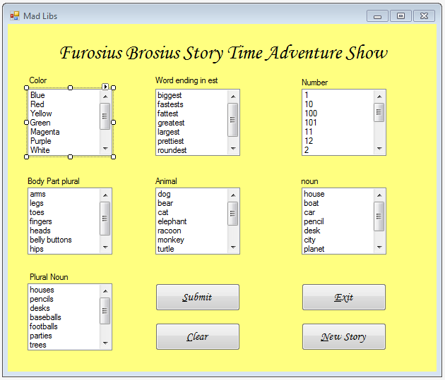

# Making Decisions Chapter 4

<h4>Objective</h4>
<b>In this chapter you will learn how programs use IF...Then, If...Then...Else, and If..Then...ElseIf statements to make decisions. your will learn how to compare values using relational operators and build complex comparisons using logical operators. </b>
Tutorials that we will complete for your understanding are the following.

Page 214 4-1, page 218 4-2, page 221 4-3, page 227 4-4, page 243 4-6, page 249 4-7, page 259 4-9

<h3>Complete the following it is due in your Google Site.</h3>
<ul>
    <li>Debugging 1</li>
    <li>Page 278, #1, #2, #4</li>
    <li>Mad Libs Using List Forms</li>
    
    <li>Hellow World Password</li>
 </ul>

